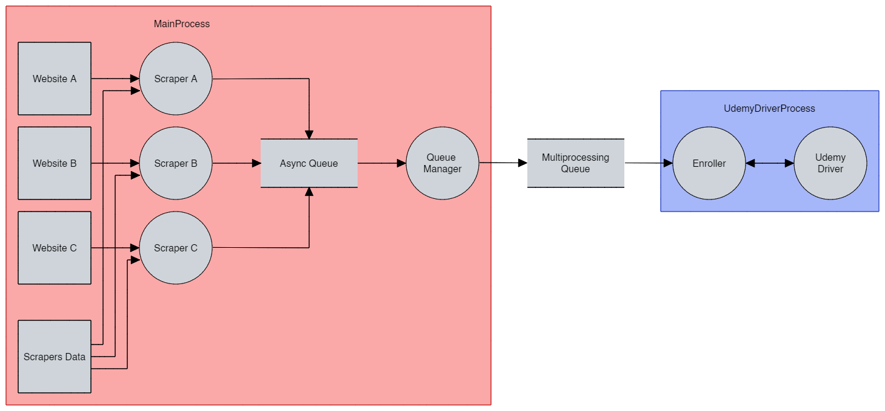

# Udemy Autocoupons


A python package that uses web scraping to obtain Udemy Coupons, and then enrolls
in them using the provided account.

It owes its performance mostly to multiprocessing, asynchronicity and persistent
data storage.

Currently supported coupons websites:

- tutorialbar.com

While similar projects exist, they are usually slow, cluttered with unnecessary
options or easily blocked by Udemy.

This project aims to avoid those issues, and focuses on:

- Exhaustiveness: we should gather the largest possible amount of courses,
  usually by increasing the amount of coupon sources.
- Performance: parallelism and removing redundancy are the main concerns for the
  architecture of this project.
- Undetectability: we should take all measures to avoid being detected. This is
  why the project does not log into any account, instead using an existing
  profile.

## Usage

It requires

- Python 3.11+
- Linux
- The latest Chrome version
- Chrome profile in `Profile 1` should be logged into the desired Udemy account

Clone this repo and move into it

```shell
git clone https://github.com/Aplietexe/udemy-autocoupons && cd udemy-autocoupons
```

Create a virtual environment

```shell
python -m venv .venv
```

Activate the virtual environment

```shell
source .venv/vin/activate
```

Install the required dependencies

```shell
pip install -r requirements.txt
```

Run the package

```shell
python -m udemy_autocoupons
```

Once that is set up, you can run it again any time you want by moving into the
directory with the project and running

```shell
source .venv/vin/activate && python -m udemy_autocoupons
```

## Contributing

Contributions are welcome, check [CONTRIBUTING](docs/CONTRIBUTING.md).

## Architecture

Because of Cloudflare bot detection, the only consistent option is to use
Selenium, which is synchronous. The solution then is to use multiprocessing to
run the scrapers and Selenium in parallel, along with a process-safe data
structure to communicate between processes.

Also, we need to use an async-safe data structure to get the results of the
scrapers, as they are run asynchronously.

The result can be synthesized in the following data flow diagram:


